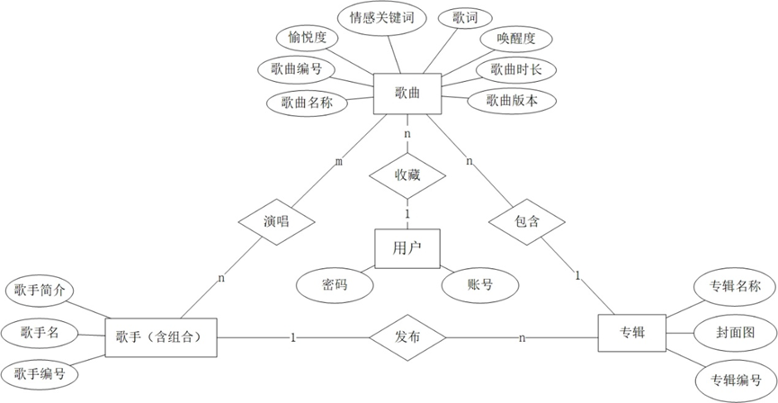

# 歌曲检索系统
  
## 系统功能介绍
- 基础检索功能：歌手、专辑、歌名、版本、全部字段的基础检索功能实现，并能展示歌曲的各种信息并在本地播放（需要下载source文件，由于文件过大没有上传）
- 歌词检索：在测试页面将基于TF-IDF的检索与基于whoosh的检索相对比，比较各自的检索时间与检索结果
- 主题抽取：基于TF-IDF排名前五的词、基于LDA方法对每首歌曲的主题进行提取
- 情感分析：分别基于百度情感倾向分析平台和基于VA二维情感模型批量向GPT-4提问的方法，得到每首歌的情感关键词，由于百度情感倾向分析为三分类问题（即正向、中立和负向）信息量不如GPT-4提供的词语大，我们选择后者建立检索点

登录界面：用户名：admin；密码：123456

## 系统框架
本系统基于Html+Flask+Mysql框架
- data_files：存放数据库文件和倒排档索引、停用词表
- static：存放各种图片及专辑音频等静态资源
- model: 实现后端各个功能
- templates: 实现前端各个页面
- app.py：连接前后端，实现交互功能

## 数据库介绍

我们从酷狗音乐上根据歌手名爬取了1000多条歌曲数据，根据上面的ER图转换成含有如下6张表的数据库music
- albums专辑（专辑编号、专辑名称、歌手编号）
- artists歌手（歌手编号、歌手名称）
- songs歌曲（歌曲编号、歌曲名称、歌曲时长、歌曲版本、歌词、专辑编号）
- performance演唱（歌手编号、歌曲编号）
- user（用户名，密码）
- collects（用户名，收藏的歌曲编号）

## 需要完善的点
- 数据部分：增大爬取的数据量，添加歌曲、专辑发行时间字段
- 检索逻辑：专辑图片检索、哼唱识别检索
- 登录界面：分管理员和普通用户两种身份

## 运行方法
- 需要安装以下的python包：Flask(backend)、Pymysql(connecting the backend and the database)
- 数据库连接：在navicat或者mysql中运行全部的sql文件，修改data.py中有关db的username和password;
- 在编辑配置中新建编辑器如Flask Server，选择路径为app.py文件，
- 运行得到网站的url，点击url即可在浏览器中登录该歌词系统
