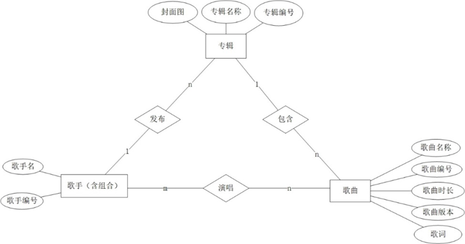

# 歌词检索系统
  
## 系统功能介绍
功能：

- 歌曲检索功能
- 主题抽取
- 情感分析

登录界面：用户名：admin；密码：123456

## 需要完善的点
数据部分：歌词的切词

前端：

后端：

## 依赖项
本系统基于Html+Flask+Mysql框架，需要安装以下的python包
- Flask(backend)
- Pymysql(connecting the backend and the database)

## 数据库介绍

我们从酷狗音乐上根据歌手名爬取了1000多条歌曲数据，根据上面的ER图转换成含有如下4张表的数据库music
- albums专辑（专辑编号、专辑名称、歌手编号）
- artists歌手（歌手编号、歌手名称）
- songs歌曲（歌曲编号、歌曲名称、歌曲时长、歌曲版本、歌词、专辑编号）
- performance演唱（歌手编号、歌曲编号）

## 运行方法
- 数据库连接：在navicat或者mysql中运行全部的sql文件，修改data.py中有关db的username和password;
- 在编辑配置中新建编辑器如Flask Server，选择路径为app.py文件，
- 运行得到网站的url，点击url即可在浏览器中登录该歌词系统
